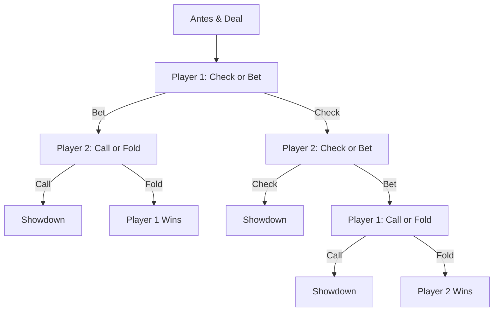

# Kuhn Poker with CFR
Kuhn Poker is a 2-player, 3-card simplified poker game used to study imperfect information games. The deck consists of a __Jack__, a __Queen__, and a __King__.
Each player antes 1 unit, each player recieves a random card. The game tree is small:

This program uses basic __Counterfactual Regret Minimization__ to solve this game.
